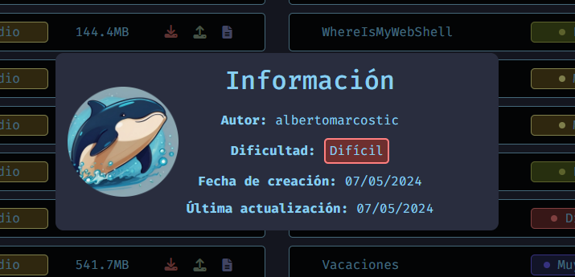

# HackTheHeaven CTF (download)

## HackTheHeaven

This is mi first CTF automated in Docker. This CTF is uploaded in [DockerLabs](https://dockerlabs.es/#/).

Thanks to [Maalfer](https://github.com/Maalfer) for the help in the construction of this CTF.

<figure><figcaption></figcaption></figure>

***

## How to run the machine?

Go to [DockerLabs](https://dockerlabs.es/#/) and download **HackTheHeaven**.

<figure><figcaption></figcaption></figure>

Unzip the file:

```shell
unzip hacktheheaven.zip
```

Give run permissions to the **auto\_deploy.sh** script:

```shell
chmod +x auto_deploy.sh
```

Run the script to deploy the machine:

```shell
./auto_deploy.sh hachtheheaven.tar
```
